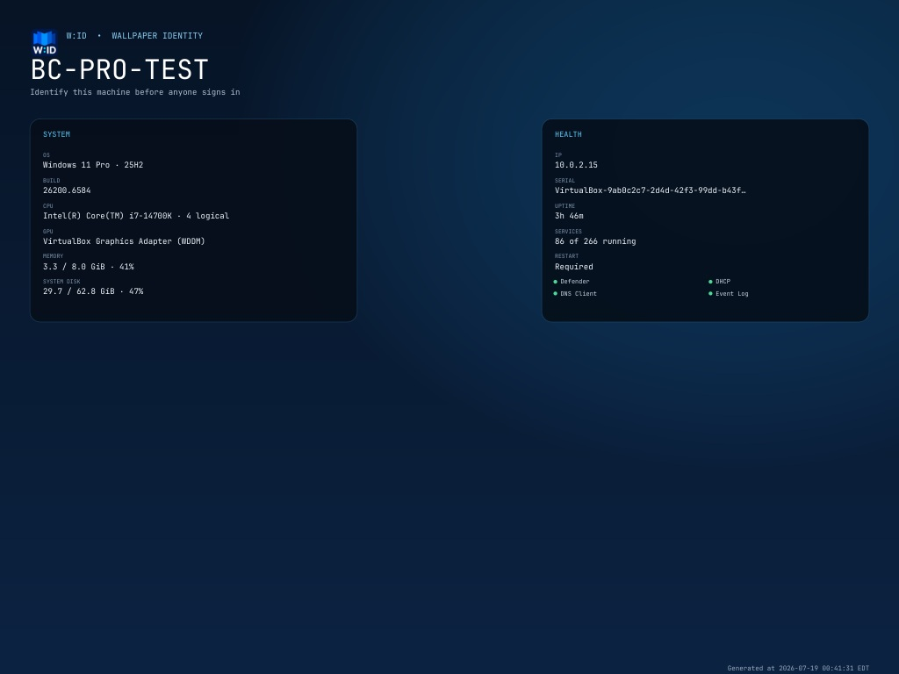
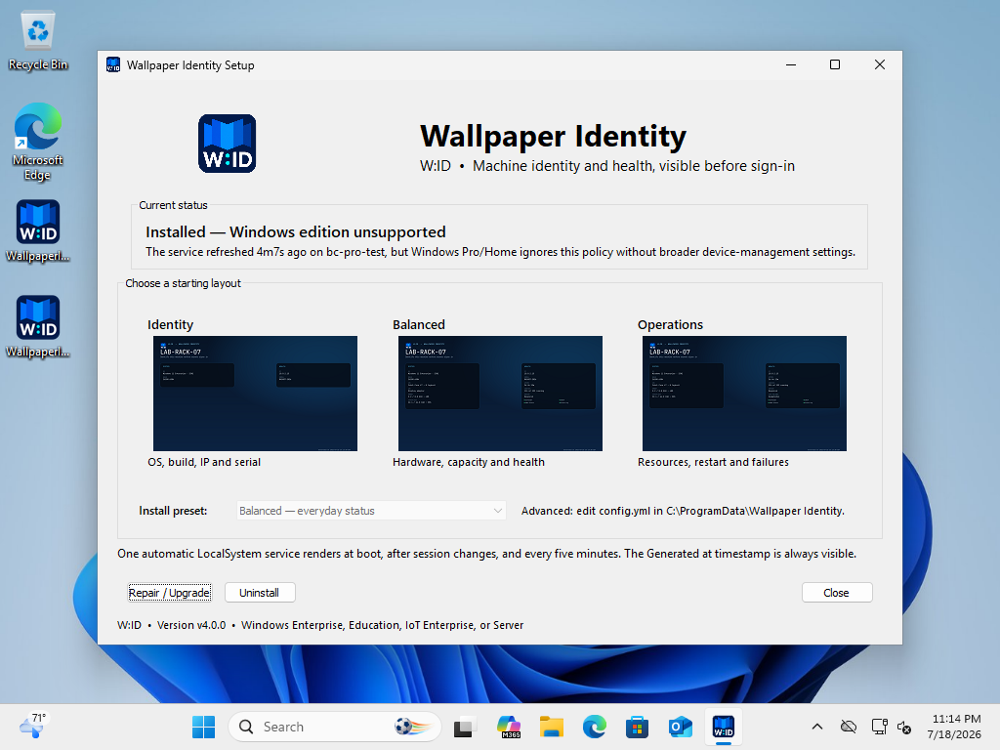

<p align="center">
  
</p>

<h1 align="center">Wallpaper Identity</h1>

<p align="center"><strong>W:ID</strong> — machine identity and health, visible before sign-in.</p>

Wallpaper Identity renders live, fastfetch-style machine information into the Windows lock and sign-in background before anyone logs in. It is designed for labs, equipment rooms, VM fleets, classrooms, and other places where visually identical computers are difficult to tell apart.



This is a real service-generated background from the Windows 11 Pro validation guest. Pro retained its stock lock screen, as documented below; supported Enterprise-class editions use this image for the lock and sign-in background.

## What it shows

- Hostname, Windows version/build, BIOS serial number, and IPv4 addresses
- CPU, GPU, memory, system-disk usage, and uptime
- Running-service count and the state of Defender, DHCP, DNS, Event Log, time sync, and Windows Update
- Pending-reboot state and the exact generation time

Hostname and a timezone-qualified **Generated at** timestamp are permanent parts of every W:ID layout, including custom configurations, so stale output is immediately obvious.

The layout reserves Windows 11's top-center clock area and Windows 10's lower-left clock area. The installer also enables Microsoft's **Show clear logon background** policy so the information remains readable on the credential screen.

## Install

1. Download `WallpaperIdentitySetup.exe` from the [latest release](https://github.com/amcchord/WallpaperIdentity/releases/latest).
2. Open it, choose a starting layout, and select **Install**.
3. Approve the Windows administrator prompt.

The W:ID installer is self-contained and works offline. It shows real rendered previews for **Identity**, **Balanced**, and **Operations**, then installs one automatic LocalSystem service and immediately generates the first background.

For unattended deployment, the companion `WallpaperIdentityCLI.exe` provides strict, blocking `install`, `repair`, `upgrade`, `status`, `refresh`, `render`, and `uninstall` commands with JSON/result-file output and stable exit codes. See the [headless and RMM guide](docs/CLI.md).



Run the same executable again to repair, upgrade, or uninstall. W:ID is also registered in Windows **Apps & features**.

### Upgrading from version 3

Version 4 detects the previous service automatically. **Repair / Upgrade** preserves and moves its `config.yml`, generated images, logs, and rollback data into the new Wallpaper Identity paths, replaces the service and Apps & features entry, and removes the previous install directory. Custom layouts are retained.

## Supported Windows editions

| Edition | Support |
|---|---|
| Windows 10/11 Enterprise or Education | Supported |
| Windows 10/11 IoT Enterprise | Supported |
| Windows Server | Supported through Group Policy |
| Windows Pro | Not supported by default; tested Pro systems accept the writes but ignore the image |
| Windows Home | Not supported |

This boundary comes from Windows policy support, not an installer check. Microsoft documents that the Personalization CSP works on Pro only when the device is already configured with SharedPC `SetEduPolicies` or `BootToCloudPCEnhanced`. W:ID does not silently enable either broader device-management mode. It reports the detected edition in its status file and UI instead of claiming that the background is active. See Microsoft's [lock-screen configuration matrix](https://learn.microsoft.com/windows/configuration/background/), [Personalization CSP requirements](https://learn.microsoft.com/windows/client-management/mdm/personalization-csp), and [Shared PC policy effects](https://learn.microsoft.com/windows/configuration/shared-pc/shared-pc-technical).

## Why W:ID refreshes before sign-in

1. The Service Control Manager starts `WallpaperIdentity` as LocalSystem during boot, before interactive logon.
2. The service gathers current machine state and renders a new, versioned JPEG in `C:\ProgramData\Wallpaper Identity\backgrounds`.
3. It applies Microsoft's machine lock-screen Group Policy and, where available, the LocalSystem-only `MDM_Personalization` WMI bridge.
4. It refreshes after boot settles, every five minutes, and on logon, logoff, lock, and power events.
5. If the lock screen is already visible, it restarts only `LockApp.exe`. It never terminates the security-sensitive `LogonUI.exe` process.

Rotating the image filename on every render prevents Windows from reusing a stale cached image. Microsoft documents that [auto-start services run during system boot](https://learn.microsoft.com/windows/win32/services/automatically-starting-services) and that the [`MDM_Personalization` class](https://learn.microsoft.com/windows/win32/dmwmibridgeprov/mdm-personalization) is available in the LocalSystem partition.

More detail is in [docs/ARCHITECTURE.md](docs/ARCHITECTURE.md).

## Configuration and diagnostics

Wallpaper Identity creates:

```text
C:\Program Files\Wallpaper Identity\WallpaperIdentity.exe
C:\ProgramData\Wallpaper Identity\config.yml
C:\ProgramData\Wallpaper Identity\status.json
C:\ProgramData\Wallpaper Identity\WallpaperIdentity.log
C:\ProgramData\Wallpaper Identity\backgrounds\
```

| Preset | Focus | Included details |
|---|---|---|
| **Identity** | Tell similar machines apart quickly | OS/build, IPv4, serial |
| **Balanced** | Everyday machine status | Identity plus CPU/GPU, memory, disk, uptime, service count, restart state, critical services |
| **Operations** | Troubleshooting and fleet health | Resources, service/restart state, and failed automatic services |

`config.yml` exposes every field as a readable Boolean. Set `preset: custom` before changing individual `show` values; changing `preset` to a named value applies that complete preset. You can also tune `refresh_minutes`, use a local JPEG/PNG with `base_image`, or force both `width` and `height`. Hostname and **Generated at** cannot be hidden.

Start from [config.example.yml](config.example.yml) and see [docs/CONFIGURATION.md](docs/CONFIGURATION.md) for the complete annotated reference. Display changes are read on the next refresh; restart the service after changing `refresh_minutes`.

Synchronous maintenance and automation commands, run from an elevated shell beside the downloaded console artifact:

```powershell
& .\WallpaperIdentityCLI.exe status --json
& .\WallpaperIdentityCLI.exe refresh --json
& .\WallpaperIdentityCLI.exe render --output C:\Temp\preview.jpg
& .\WallpaperIdentityCLI.exe repair --quiet
& .\WallpaperIdentityCLI.exe uninstall --quiet
```

## Build and test

Requirements: Windows and Go 1.24 or newer.

```powershell
go test ./...
powershell -ExecutionPolicy Bypass -File .\build.ps1 -Version v4.0.0
```

Release output is written to `dist\WallpaperIdentitySetup.exe`, `dist\WallpaperIdentityCLI.exe`, and `dist\SHA256SUMS.txt`. Both offline binaries contain the service, renderer, fonts, W:ID icon, and Windows manifest; Setup uses the graphical Windows subsystem while CLI uses the console subsystem for reliable RMM waiting, stdout, and exit codes.

The validation matrix covers Windows 10 Enterprise 22H2, Windows 11 Enterprise 25H2, and Windows 11 Pro 25H2 in parallel 8 GiB VirtualBox guests. See [docs/TESTING.md](docs/TESTING.md) for reproducible evidence and the documented Pro limitation.

## Uninstall behavior

Uninstall stops and removes the service, unregisters W:ID, and restores any lock-screen/logon policy values that existed before installation. Configuration and generated images are kept by default for audit and recovery. Product-key exports and local VM media are ignored by git.

## License

[MIT](LICENSE). JetBrains Mono is distributed under the SIL Open Font License; see [assets/fonts/OFL.txt](assets/fonts/OFL.txt).
